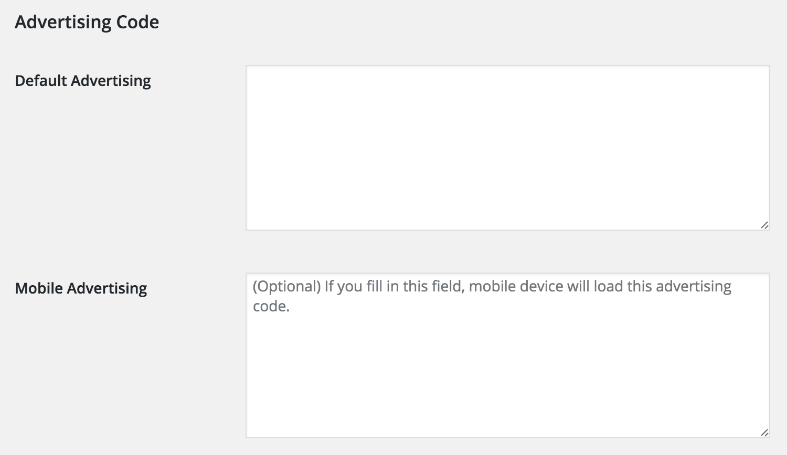

# WP Shortcode Advertising

📲 A plugin that allow you to insert advertisement via shortcode.

## Installation

You can manually install this plugin from source code.

1. Go https://github.com/chown9835/wp-shortcode-advertising/releases and download latest version zip file (wp-shortcode-advertising.zip).
1. Upload zip file to your WordPress site.
1. Active plugin.
1. Go to user profile setting page, set advertising code.
1. Edit your post or page, and insert shortcode [insert-ad].
1. View your post or page, you will see your advertisement.

## Screenshots

## Thanks

* [Mobile Detect](http://mobiledetect.net/) : A good library for detect mobile device type.
* [Chris Chang](https://github.com/chris1004tw) : Translation.
* [WordPress](https://wordpress.com) : Awesome platform for blogging.